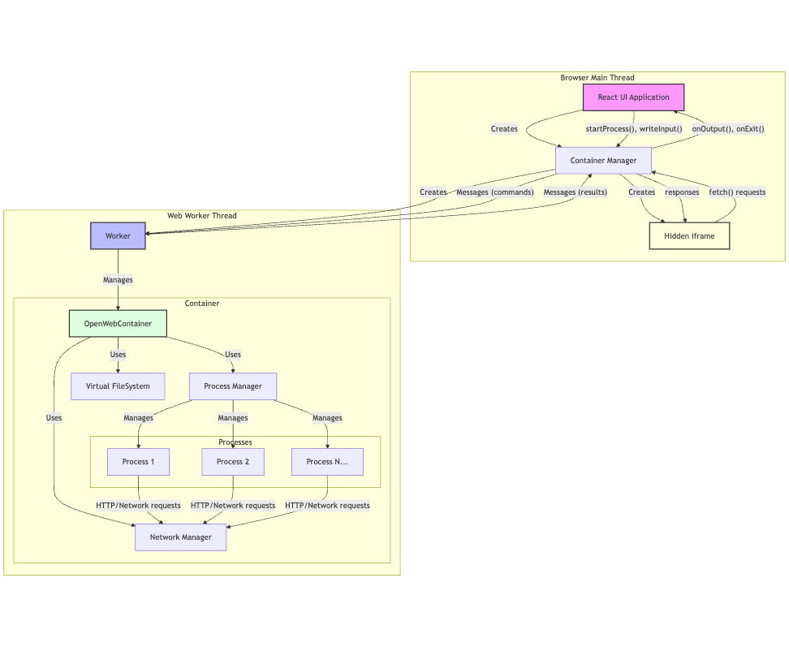

# OpenWebContainer

A browser-based virtual container runtime that enables posix compliant, server-like JavaScript execution environments directly in the browser. OpenWebContainer provides a sandboxed environment with a virtual file system, process management, and shell capabilities, making it possible to run server-side JavaScript applications entirely in the browser.

[](LICENSE)
[](CONTRIBUTING.md)

## 🗺️ Architecture Overview



The architecture consists of three main layers:
1. **UI Layer**: React-based user interface with terminal and file explorer
2. **Container Manager**: Handles communication between UI and Worker
3. **Web Worker**: Runs the actual container in an isolated thread

## ⚡ Current Progress

### ✅ Implemented Features

- **Core Container Infrastructure**
  - Web Worker integration for isolated execution
  - Container API abstraction for Worker communication
  - Event-based messaging system
  - Process lifecycle management

- **Virtual File System**
  - Full directory structure
  - Basic file operations
  - Path resolution
  - Module loading

- **Shell Environment**
  - Interactive shell with command history
  - Built-in commands:
    - `ls` - List directory contents
    - `cd` - Change directory
    - `pwd` - Print working directory
    - `mkdir` - Create directory
    - `touch` - Create file
    - `rm` - Remove file
    - `rmdir` - Remove directory
    - `cat` - Display file contents
    - `echo` - Display text
    - `cp` - Copy file
    - `mv` - Move file
  - File redirection (`>`, `>>`)

- **JavaScript Runtime**
  - QuickJS-based execution
  - ES Modules support
  - Isolated contexts
  - Console output integration

### 🚧 In Progress

- **Network Simulation**
  - Web Worker based network interceptor
  - HTTP request handling
  - Sandbox security

### 📋 Upcoming Features

- Additional shell commands
- NPM package manager simulation
- Process signals (SIGTERM, SIGKILL, etc.)
- Pipe operator (`|`) support
- WebSocket simulation

## 🚀 Features

- **Virtual File System**
  - Full directory structure support
  - File operations (create, read, write, delete)
  - Path resolution and normalization
  - Module loading capabilities

- **Process Management**
  - Multiple process types (Shell, JavaScript)
  - Process lifecycle management
  - Inter-process communication
  - Event-based architecture

- **Shell Environment**
  - UNIX-like shell commands
  - File redirection (`>`, `>>`)
  - Interactive shell support
  - Working directory management

- **JavaScript Runtime**
  - Isolated execution environments
  - ES Modules support
  - Resource management and cleanup
  - Based on QuickJS for reliable JavaScript execution

## 📦 Project Structure

```bash
.
├── apps/                      # Application packages
│   └── playground/           # Web-based playground
│       ├── src/             
│       │   ├── components/   # React components
│       │   │   ├── Editor/
│       │   │   ├── FileExplorer/
│       │   │   └── Terminal/
│       │   ├── hooks/       # React hooks
│       │   └── ...
│       └── ...
├── packages/
│   ├── api/                 # API interface package
│   │   ├── src/
│   │   │   ├── container/   # Container API
│   │   │   ├── process/     # Process-related types
│   │   │   └── worker/      # Worker bridge implementation
│   │   └── ...
│   └── core/               # Core implementation
│       ├── src/
│       │   ├── filesystem/  # Virtual filesystem implementation
│       │   ├── interfaces/  # Core interfaces
│       │   ├── network/     # Network simulation
│       │   ├── process/     # Process implementation
│       │   │   ├── base/    # Base process classes
│       │   │   ├── executors/ # Process type executors
│       │   │   └── manager/   # Process management
│       │   ├── shell/      # Shell implementation
│       │   │   ├── commands/ # Shell command implementations
│       │   │   └── ...
│       │   └── utils/      # Utility functions
│       └── ...
```

## 🛠️ Development Setup

### Prerequisites
- Node.js (v16 or higher)
- pnpm (v8 or higher)
- Git

### Installation

```bash
# Clone the repository
git clone https://github.com/thecodacus/OpenWebContainer.git
cd OpenWebContainer

# Install dependencies
pnpm install

# Start development
pnpm dev          # Start all packages
pnpm playground   # Start only the playground
```

## 📚 Usage

### Using the Core Package

```typescript
import { OpenWebContainer } from '@open-web-container/core';

async function main() {
  // Create a new container
  const container = new OpenWebContainer();

  // Create a directory and write a JavaScript file
  container.writeFile('/app/hello.js', `
    console.log('Hello from the container!');
    export const message = 'Hello World';
  `);

  // Run a shell command
  const shell = await container.spawn('sh', ['echo', 'Hello', '>', '/app/greeting.txt']);
  
  // Listen for process events
  shell.addEventListener('exit', ({ exitCode }) => {
    console.log('Shell process exited with code:', exitCode);
  });

  // Run a JavaScript file
  const jsProcess = await container.spawn('node', '/app/hello.js');
  
  // Clean up when done
  await container.dispose();
}

main().catch(console.error);
```

### API Examples

#### File System Operations

```typescript
// Directory operations
container.createDirectory('/app');
container.listDirectory('/app');
container.deleteDirectory('/app');

// File operations
container.writeFile('/app/script.js', 'console.log("Hello")');
const content = container.readFile('/app/script.js');
container.deleteFile('/app/script.js');
```

#### Process Management

```typescript
// Spawn a shell process
const shell = await container.spawn('sh', ['ls']);

// Spawn a JavaScript process
const process = await container.spawn('node', '/app/script.js');

// Process events
process.addEventListener('start', (data) => { /* ... */ });
process.addEventListener('exit', (data) => { /* ... */ });
process.addEventListener('error', (data) => { /* ... */ });
process.addEventListener('message', (data) => { /* ... */ });
```

#### Shell Commands

```typescript
// Interactive shell
const shell = await container.spawn('sh');
if (shell instanceof ShellProcess) {
  // Execute commands
  await shell.executeCommand('mkdir /app');
  await shell.executeCommand('echo "Hello" > /app/hello.txt');
  await shell.executeCommand('cat /app/hello.txt');
}
```

## 🧪 Development Commands

```bash
# Start development
pnpm dev              # Start all packages
pnpm playground       # Start only the playground
pnpm core:dev         # Start core package development

# Building
pnpm build           # Build all packages
pnpm core:build      # Build only core package

# Testing
pnpm test            # Run all tests
pnpm lint            # Run linter
pnpm format          # Format code

# Release
pnpm changeset       # Create a changeset
pnpm version-packages # Update versions
pnpm release         # Publish to npm
```

## 🛠️ Contributing

We welcome contributions! See our [Contributing Guide](CONTRIBUTING.md) for details on:
- Development workflow
- Project structure
- Testing guidelines
- Pull request process

### Areas for Contribution

- Shell command improvements
  - Add pipe (`|`) support
  - Additional built-in commands
  - Command argument parsing
- Process management enhancements
  - Process signals
  - Job control
  - Process groups
- Network features
  - HTTP request simulation
  - WebSocket support
  - Network isolation
- Developer tools
  - Debugging capabilities
  - Process inspection
  - Performance monitoring

## 📝 Roadmap

Current focus areas:
- [ ] Network simulation implementation
- [ ] NPM package manager integration
- [ ] Additional shell commands
- [ ] WebSocket support

Future plans:
- [ ] Add pipe support for shell commands
- [ ] Implement environment variables
- [ ] Add signal handling (SIGTERM, SIGKILL, etc.)
- [ ] Create process groups and job control
- [ ] Create development tools and debugging capabilities

## 📄 License

This project is licensed under the MIT License - see the [LICENSE](LICENSE) file for details.

## 🤝 Acknowledgments

- [QuickJS](https://bellard.org/quickjs/) - The JavaScript engine used in this project
- [quickjs-emscripten](https://github.com/justjake/quickjs-emscripten) - WebAssembly build of QuickJS

## 💬 Support

- Create an issue for bug reports or feature requests


## Similar Projects
- [Nano Web IDE](https://github.com/anbraten/nano-web-ide)
